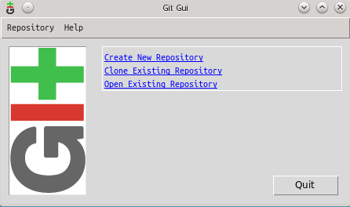
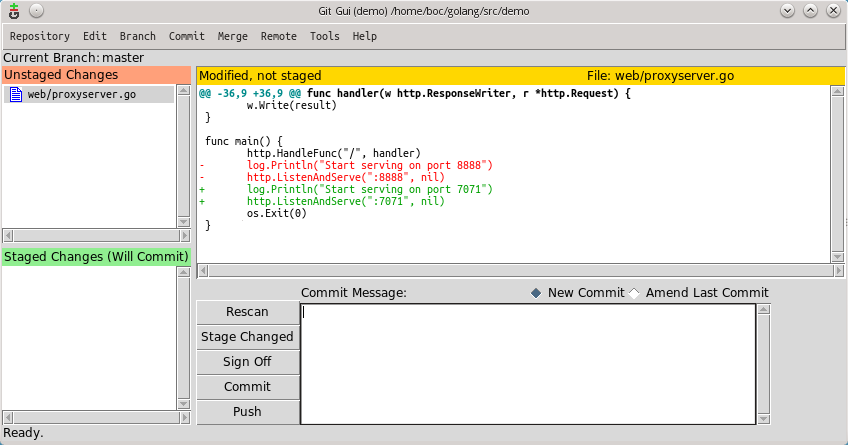
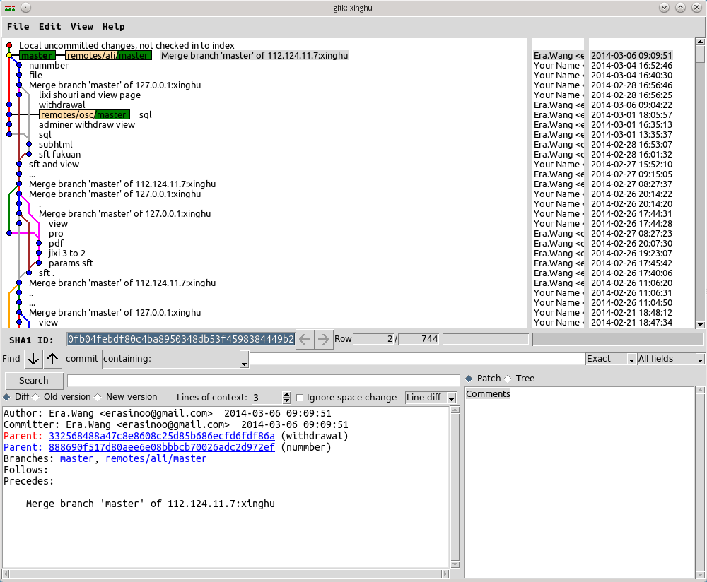
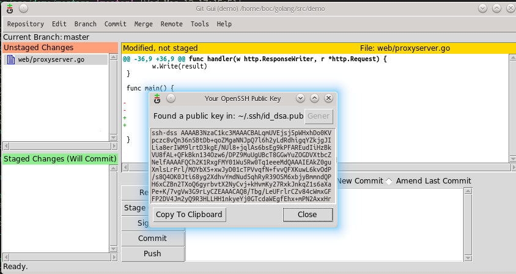

# git 的使用

主要的作用为：

* 多人项目的合作（合并代码）
* 代码安全的管理（可以通过日志来记录每一次的提交变动）
* 代码的上传    （直接代码推送到服务器）
* 服务器的防篡改部署的理解

## 下载

    http://git-scm.com/downloads

## 配置

配置全局信息，用户标记你提交时的记录名称。

    git config --global user.name "your name"
    git config --global user.email "your Email"

## 使用

使用 `git` 直接查看帮助文档。

    $ git 

    usage: git [--version] [--help] [-C <path>] [-c name=value]
               [--exec-path[=<path>]] [--html-path] [--man-path] [--info-path]
               [-p|--paginate|--no-pager] [--no-replace-objects] [--bare]
               [--git-dir=<path>] [--work-tree=<path>] [--namespace=<name>]
               <command> [<args>]

    最常用的 git 命令有：
       add        添加文件内容至索引
       bisect     通过二分查找定位引入 bug 的变更
       branch     列出、创建或删除分支
       checkout   检出一个分支或路径到工作区
       clone      克隆一个版本库到一个新目录
       commit     记录变更到版本库
       diff       显示提交之间、提交和工作区之间等的差异
       fetch      从另外一个版本库下载对象和引用
       grep       输出和模式匹配的行
       init       创建一个空的 Git 版本库或重新初始化一个已存在的版本库
       log        显示提交日志
       merge      合并两个或更多开发历史
       mv         移动或重命名一个文件、目录或符号链接
       pull       获取并整合另外的版本库或一个本地分支
       push       更新远程引用和相关的对象
       rebase     本地提交转移至更新后的上游分支中
       reset      重置当前HEAD到指定状态
       rm         从工作区和索引中删除文件
       show       显示各种类型的对象
       status     显示工作区状态
       tag        创建、列出、删除或校验一个GPG签名的 tag 对象

    命令 'git help -a' 和 'git help -g' 显示可用的子命令和一些指南。参见
    'git help <命令>' 或 'git help <指南>' 来查看给定的子命令帮助或指南。

### 基本操作

首先创建过滤文件 `.gitignore`，然后操作

    git init                                 # 创建初始
    git add .                                # 追加或修改文件到缓存区
    git status                               # 查看状态 （做任何操作后习惯性的查看当前状态）
    git commit -a -m " the messages ... "    # 提交修改
    git log                                  # 查看日志
    git log -g                               # 查看所有日志，包括本地已经删除的分支日志
    git tag v2                               # 添加名为 'v2' 的标志

> 在任何操作后养成习惯性的查看当前状态

### 分支操作

参考[分支操作](/books/progit/03-git-branching)

    git branch                               # 查看当前工作区分支所在
    git branch branchname                    # 以当分支为基础创建新的分支
    git branch -D branchname                 # 强制删除分支 （不要删除当前分支）
    git checkout branchname                  # 切换分支工作区域

> 在切换分之前查看修改状态，在未提交修改前，不要进行分支的切换。

    git checkout -b branchname               # 创建分支并切换到新建的额分支

分支的合并

    git merge branchname                     # 在本地进行合并分支

合并分之后如果有冲突，使用 `git status` 查看状态，然后对冲突的文件进行修改后提交。

> 合并分支还有另外一种`rebase` 衍合

魔法分支操作

    git log [-g]                            # 查看日志
    git checkout loghashname                # 进入 日志的hash名称的分支

文件还原

    git checkout filepathname               # 对当前未提交修改的文件还原

> 另外万不得已不要进行 `git reset`等恢复（回滚）操作，特别是在和别人同时使用源的时候。 回滚日志，你的同伴会憎恨你的。

### 库操作

创建纯仓库，如果不使用第三方而使用自己的服务器可以考虑建立纯仓库，可以参考[git服务器](/books/progit/04-git-server) **架设服务器**小结。

    mkdir sitesource.git
    cd sitesource.git 
    git init --bare

推送内容到仓库

    cd demo1
    touch readme
    git init
    git add .
    git commit -a -m 'init'
    git remote add origin ~/sitesource.git
    git push origin master

克隆仓库

    git clone ~/sitesource.git demo2      # 克隆残酷
    git pull -u origin master             # 更新拉取
    git push -u origin master             # 推送更新内容（推送前一定要拉取下）

首次拉取 pull 和 推送 push 使用参数 **`-u`**,可以设置为默认的对象。之后就可以使用 `git pull ` 和 `git push ` 来默认操作当前分支了。

    git fetch origin                                  # 同步服务器的分支
    git git checkout -b branchname origin/branchname  # 以服务器的分支创建新的分支

    git push origin :branchname                       # 删除远端分支

> 不要在远程分支上直接操作

## GUI 操作

    git gui  打开主窗口
    gitk 打开log日志 

没有仓库的时候显示

添加文件和修改文件使用 `stage changed` 将修改的文件添加的缓存区中。`git add`

> 当显示的内容为乱码时候，到 `edit` > `config` 中修改编码配置。`git commit -m 'xxx'`

提交修改 `Commit` 按钮

可以菜单`branch` 中执行分支的操作。

查看历史 Repository > viua...history ，可以查看当前分支，和全部分支。也可以直接打开 `gitk`。
    

## SSH Keys

可以使用 gui来生成

    git gui
    菜单中 gitk -> help -> show ssh key

在创建密钥时会提示你`是否使用密码`，该密码管理着密钥的使用，在进行 clone,fetch,push,pull 操作的时候。

SSH key 可以让你在你的电脑和服务器端之间建立安全的加密连接。  左侧的`copy to clipboard`可以默认拷贝。

在linux下，你可以按如下命令来生成sshkey

    ssh-keygen -t rsa -C "xxxxx@xxxxx.com" 

查看你的public key，并把他添加到 Git @ OSC http://git.oschina.net/keys

    cat ~/.ssh/id_rsa.pub
    # ssh-rsa AAAAB3NzaC1yc2EAAAADAQABAAABAQC6eNtGpNGwstc....

## git.oschina.net 的使用

到 <http://git.oschina.net> 注册帐号或者到 github.com 注册。

1 > 创建一个项目（公有或私有）  `notes`

默认会提示你一个操作。

> http://git.oschina.net/era/notes

进入项目管理： 项目组管理可以添加开发人员。

到**部署公钥管理** 中将自己ssh-key,添加进去

2 > 本地操作

将现有的代码提交到服务器：

    cd notes
    git remote add origin git@git.oschina.net:era/notes.git
    git push -u origin master

如果新创建：

    mkdir notes
    cd notes
    git init
    touch README.md
    git add README.md
    git commit -m "first commit"
    git remote add origin git@git.oschina.net:era/notes.git
    git push -u origin master

3 > 本地与服务器的操作

    git ....                     # 本地库操作
    git pull                     # 上传前拉去
    git push                     # 上传

